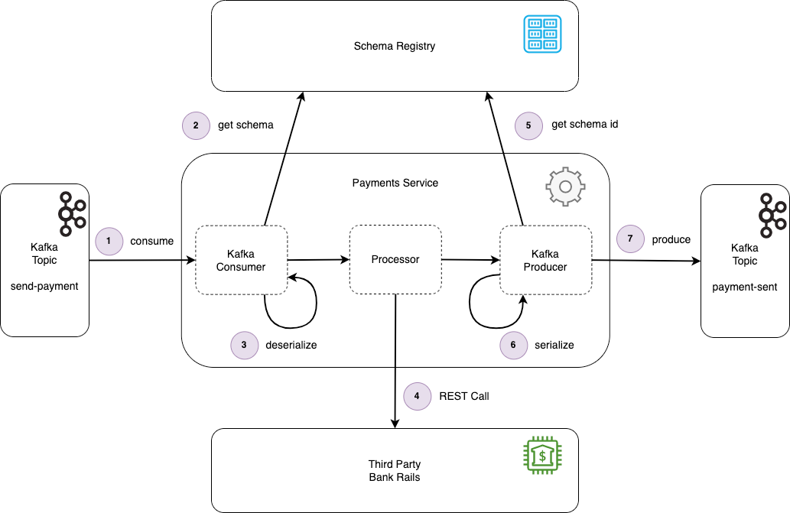

# Spring Kafka Example with Apache Avro Support

This repository contains a Spring Kafka example project with Apache Avro support, based on the [Kafka Schema Registry & Avro: Spring Boot Demo (1 of 2)](https://www.lydtechconsulting.com/blog-kafka-schema-registry-demo-part1.html) blog post by Lydtech Consulting.

## Key Technologies

- Java 17
- Spring Boot 3
- Spring Kafka
- Gradle
- Apache Avro
- Confluent Schema Registry

## Overview

The application simulates a basic payment service. It listens to a Kafka topic named send-payment for incoming payment commands. Upon receiving a command, it simulates making a payment by calling a third-party banking service through REST (this is just a placeholder in the code and does not actually make a call). After processing, the application publishes an event to the payment-sent Kafka topic.

The messages are serialized and deserialized using Avro schemas, and the application interacts with the Confluent Schema Registry to manage these schemas.



## Prerequisites
- Docker
- Java 17
- Gradle

## Getting Started

**Build the application**
```
gradle clean build
```

**Run teh application**
```
java -jar build/libs/<your-jar-file>.jar
```

**Register Avro Schemas**
Register the Avro schemas with the Confluent Schema Registry. The schemas are located in the src/main/avro directory.